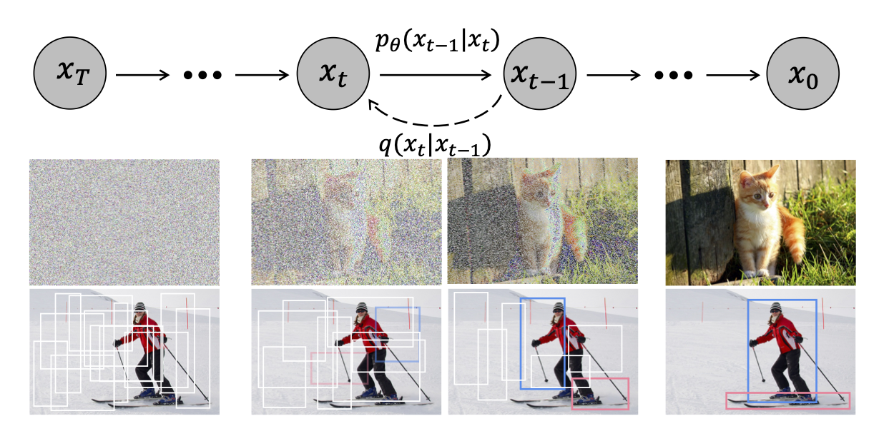

## DiffusionDet: Diffusion Model for Object Detection

> ## ⚡ fast-diffusiondet —— 高效扩散采样机制研究分支
>
> 本仓库是 upstream DiffusionDet 的 fork，目标是替换其 DDIM 推理（步数长、耗时久），
> 系统性对比 **DDIM / EDM(Heun+Karras) / PFGM++(重尾泊松流) / DPM-Solver-v3(EMS 高阶多步)**
> 在**同等 NFE 预算**下的检测精度与推理耗时。
>
> - 蓝图与里程碑：**[docs/BLUEPRINT.md](docs/BLUEPRINT.md)**
> - 实时工作状态：**[docs/PROGRESS.md](docs/PROGRESS.md)**
> - 实验数据（M2 起）：`docs/RESULTS.md`
>
> ### 与原 repo 的关系
>
> | 项目 | 说明 |
> |---|---|
> | 基准代码 | 来自本地 `../DiffusionDet-main/`（未纳入本仓库的版本管理） |
> | 新增代码 | `diffusiondet/solvers/`、`configs/lab/`、`scripts/`、`docs/`、`results/` |
> | 归档代码 | `legacy/experimental/` —— upstream 遗留的半成品实验代码，**不可运行**，已从 `diffusiondet/` 包中移除导入，仅留作参考 |
> | 不入库 | 预训练权重（`petrain/`）、训练产物（`output/`）、EMS 统计量（`statistics/`，可由 `scripts/` 重算） |
>
> ⚠ `legacy/experimental/samplers/{l.npz,sb.npz}` 是上游遗留的 **CIFAR-10 图像**统计量
> （形状 `(121, 3, 32, 32)`），与本项目 box 数据 `(B, P, 4)` 不兼容，**必须自算**，见蓝图 §3.4。
>
> ### 快速开始
>
> ```powershell
> conda activate detectron2                # Py3.8.17 / torch 1.10.0+cu113 / detectron2 0.6
> cd e:/Files/DL-code/model+/diffusion-model/fast-diffusiondet
>
> # 训练（M0）
> python train_net.py --config-file configs/lab/sdd.res50.yaml
>
> # 评测
> python train_net.py --config-file configs/lab/sdd.res50.yaml --eval-only MODEL.WEIGHTS <ckpt>.pth
> ```
>
> 数据集位于 `../dataset/`：`PLS/Plantv2`（16 类）、`SDD/Strawberry`（7 类）。
> 两者 json 均含 `(0, '_background_')` 而 GT 从不使用，注册时必须自建 id 映射。

**DiffusionDet is the first work of diffusion model for object detection.**




> [**DiffusionDet: Diffusion Model for Object Detection**](https://arxiv.org/abs/2211.09788)               
> [Shoufa Chen](https://www.shoufachen.com/), [Peize Sun](https://peizesun.github.io/), [Yibing Song](https://ybsong00.github.io/), [Ping Luo](http://luoping.me/)                 
> *[arXiv 2211.09788](https://arxiv.org/abs/2211.09788)* 

## Updates
- (11/2022) Code is released.

## Models
Method | Box AP (1 step) | Box AP (4 step) | Download
--- |:---:|:---:|:---:
[COCO-Res50](configs/diffdet.coco.res50.yaml) | 45.5 | 46.1 | [model](https://github.com/ShoufaChen/DiffusionDet/releases/download/v0.1/diffdet_coco_res50.pth)
[COCO-Res101](configs/diffdet.coco.res101.yaml) | 46.6 | 46.9 | [model](https://github.com/ShoufaChen/DiffusionDet/releases/download/v0.1/diffdet_coco_res101.pth)
[COCO-SwinBase](configs/diffdet.coco.swinbase.yaml) | 52.3 | 52.7 | [model](https://github.com/ShoufaChen/DiffusionDet/releases/download/v0.1/diffdet_coco_swinbase.pth)
[LVIS-Res50](configs/diffdet.lvis.res50.yaml) | 30.4 | 31.8 | [model](https://github.com/ShoufaChen/DiffusionDet/releases/download/v0.1/diffdet_lvis_res50.pth)
[LVIS-Res101](configs/diffdet.lvis.res101.yaml) | 31.9 | 32.9 | [model](https://github.com/ShoufaChen/DiffusionDet/releases/download/v0.1/diffdet_lvis_res101.pth)
[LVIS-SwinBase](configs/diffdet.lvis.swinbase.yaml) | 40.6 | 41.9 | [model](https://github.com/ShoufaChen/DiffusionDet/releases/download/v0.1/diffdet_lvis_swinbase.pth)


## Getting Started

The installation instruction and usage are in [Getting Started with DiffusionDet](GETTING_STARTED.md).


## License

This project is under the CC-BY-NC 4.0 license. See [LICENSE](LICENSE) for details.


## Citing DiffusionDet

If you use DiffusionDet in your research or wish to refer to the baseline results published here, please use the following BibTeX entry.

```BibTeX
@article{chen2022diffusiondet,
      title={DiffusionDet: Diffusion Model for Object Detection},
      author={Chen, Shoufa and Sun, Peize and Song, Yibing and Luo, Ping},
      journal={arXiv preprint arXiv:2211.09788},
      year={2022}
}
```